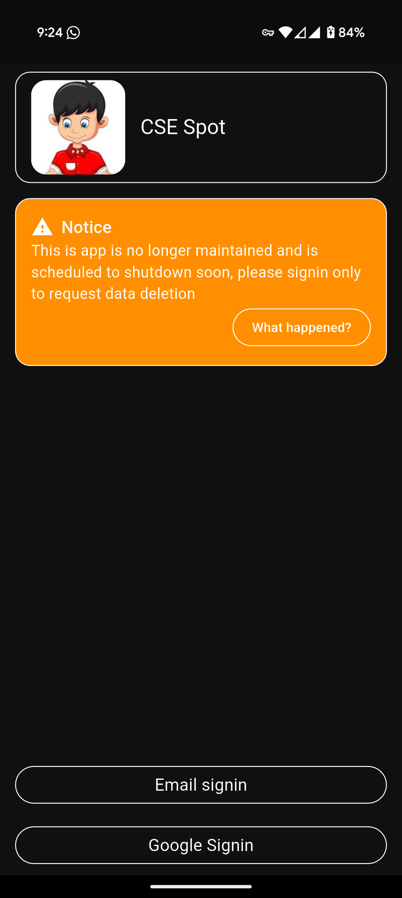
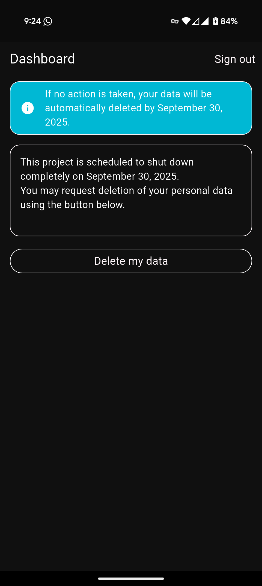

# Cse Spot 

## Data Deletion
To request data deletion use the latest version of app (version code 60 or above), and follow the below steps.
### Steps
- Login using Email or Google signin.

- Use the **Delete my data** button on the home screen to delete data.

    
    

