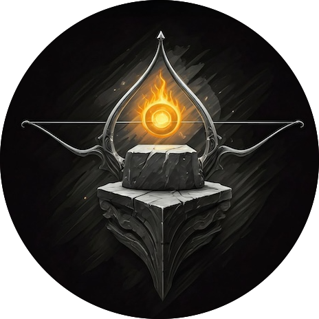

<table align="center">
  <tr>
    <td align="center"></td>
    <td align="center" style="font-size: 2em;">➡️</td>
    <td align="center"></td>
  </tr>
</table>

# 👋 Farewell from CSE Spot

Thank you for being a valuable member of **CSE Spot**!

---

## 📖 What Happened?  
CSE Spot was created during my early days as a developer, with the idea of making course material more accessible.  
I had bigger plans—like adding old exam papers, building a community, and even making it open source—but those ideas never fully came to life.  

---

## 🔄 Change of Philosophy  
Today, we’re focused on building [**KarnaForge**](https://karnaforge.dev), an open-source community guided by the philosophy:  

**_"Forging open source with purpose"_**  

We draw inspiration from the generosity of **Karna** from the *Mahabharata*.  

---

## 🛑 Decommission  
Building [KarnaForge](https://karnaforge.dev) alongside our daily work takes a lot of effort.  
With that in mind, we’ve decided to **decommission CSE Spot**.  

---

## ❤️ Farewell  
Thank you once again for supporting CSE Spot.  
We hope you’ll join us and continue the journey at [**KarnaForge**](https://karnaforge.dev). **(Here’s a secret: we welcome contributions 😉!)**
